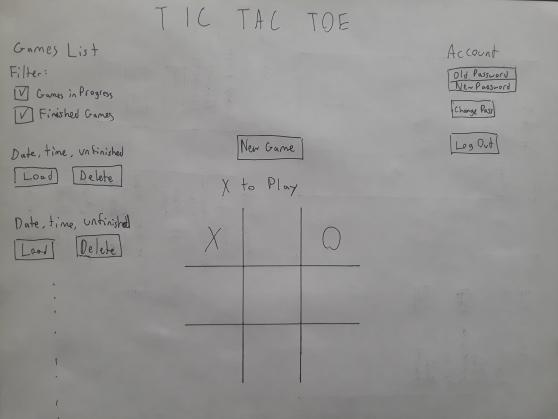

# Tic-Tac-Toe

This is a client application for an API that allow users to sign up, log in, and play tic tac toe games.

Tic tac toe is a pencil and paper game in which two players play X's or O's in a grid on alternating turns, and the first player to create a complete line of their symbol wins.

### Technologies Used

Javascript, HTML, CSS/Sass
JQuery, AJAX
Bootstrap, Webpack
Bash, curl

### Plan

My plan was to first build the structure of the HTML page, to get a visual display of a board. Next I would build the game logic, to have a working tic tac toe game that allowed x's and o's to be placed. Basic authentication functions to the API's specifications were next, so that I could continue with using the API for game events as well. Once those were working, I would return to the UI to make things look prettier.

### User Stories

A User can sign up with an email and a password, and log in.
A User can play tic tac toe, and know when their game is over.
A User can win, lose, or draw a game.
A User can adjourn games and return to them later.
A User can find old games that they have played.

### Wireframes

### Future goals

- Let the sidebar scroll
- Make the sidebar look nicer
- Separate the account sidebar from the games list
- Display stats for the user
- Filter games on the games list for finished and unfinished games
- Implement an AI for a user to play against

#### [License](LICENSE)

1. All content is licensed under a CC­BY­NC­SA 4.0 license.
1. All software code is licensed under GNU GPLv3. For commercial use or
    alternative licensing, please contact legal@ga.co.
