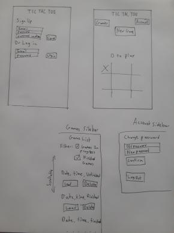

# Tic-Tac-Toe

This is a client application for an API that allow users to sign up, log in, and play tic tac toe games.

Tic tac toe is a pencil and paper game in which two players play X's or O's in a grid on alternating turns, and the first player to create a complete line of their symbol wins.

### Technologies Used

Javascript, HTML, CSS/Sass
JQuery, AJAX
Bootstrap, Webpack
Bash, curl

### Wireframes

#### [License](LICENSE)

1. All content is licensed under a CC­BY­NC­SA 4.0 license.
1. All software code is licensed under GNU GPLv3. For commercial use or
    alternative licensing, please contact legal@ga.co.
